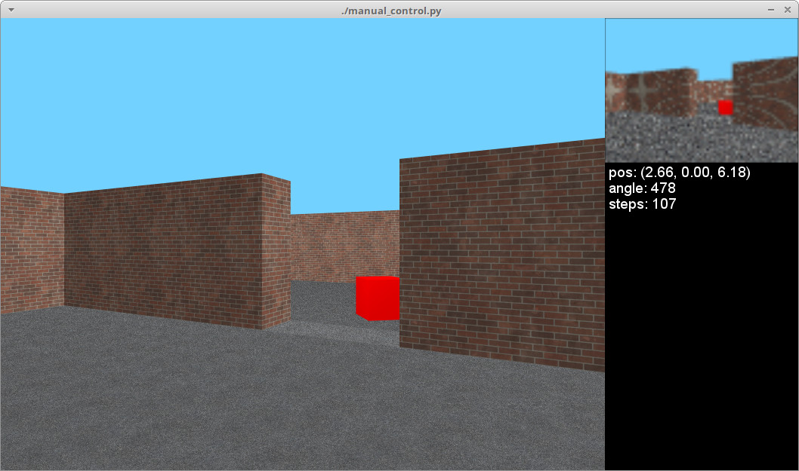

# MiniWorld (gym-miniworld)

**Note that this environment is early in development. It's very basic and you may run into bugs.
If you do run into problems, or if you want to request specific features, please open an issue
on this repository. Your feedback helps me make this project better.***

MiniWorld is a minimalistic 3D interior environment simulator for reinforcement
learning &amp; robotics research. It can be used to simulate environments with
rooms, doors, hallways and various objects (eg: office and home environments, mazes).
MiniWorld can be seen as an alternative to VizDoom or DMLab. It is written
100% in Python and designed to be easily modified or extended.

<p align="center">
</img>
</img>
</img>
</p>

Advantages of MiniWorld:
- Compatible with OpenAI Gym
- Few dependencies, less likely to break, easy to install
- Easy to modify, customize or extend
- Good performance, high frame rate, support for multiple processes
- Lightweight, small download, low memory requirements
- Software provided under a permissive MIT license

Limitations:
- Graphics are basic, nowhere near photorealism
- Physics are very basic, not sufficient for robot arms/etc

Please use this bibtex if you want to cite this repository in your publications:

```
@misc{gym_miniworld,
  author = {Chevalier-Boisvert, Maxime},
  title = {gym-miniworld environment for OpenAI Gym},
  year = {2018},
  publisher = {GitHub},
  journal = {GitHub repository},
  howpublished = {\url{https://github.com/maximecb/gym-miniworld}},
}
```

This simulator was created as part of work done at [Mila](https://mila.quebec/).

## Installation

Requirements:
- Python 3.5+
- OpenAI Gym
- NumPy
- PyYAML
- Pyglet (3D graphics)

You can install all the dependencies with `pip3`:

```
git clone https://github.com/maximecb/gym-miniworld.git
cd gym-miniworld
pip3 install -e .
```

If you run into any problems, take a look at the troubleshooting
section below, and if you're still stuck, please
[open an issue](https://github.com/maximecb/gym-miniworld/issues) on this
repository to let us know something is wrong.

## Usage

### Testing

There is a simple UI application which allows you to control the simulation or real robot manually. The `manual_control.py` application will launch the Gym environment, display camera images and send actions (keyboard commands) back to the simulator or robot.

```
./manual_control.py --env-name MiniWorld-Hallway-v0
```

There is also a script to run automated tests (`run_tests.py`) and a script to gather performance metrics (`benchmark.py`).

### Reinforcement Learning

To train a reinforcement learning agent, you can use the code provided in the [/pytorch-a2c-ppo-acktr](/pytorch-a2c-ppo-acktr) directory. This code is a modified version of the RL code found in [this repository](https://github.com/ikostrikov/pytorch-a2c-ppo-acktr). I recommend using the PPO algorithm and 16 processes or more. A sample command to launch training is:

```
python3 main.py --algo ppo --num-frames 5000000 --num-processes 16 --num-steps 80 --lr 0.00005 --env-name MiniWorld-Hallway-v0
```

Then, to visualize the results of training, you can run the following command. Note that you can do this while the training process is still running. Also note that if you are running this through SSH, you will need to enable X forwarding to get a display:

```
python3 enjoy.py --env-name MiniWorld-Hallway-v0 --load-dir trained_models/ppo
```

## Design

### Coordinate System

MiniWorld uses OpenGL's right-handed coordinate system. The ground plane lies along the X and Z axes, and the Y axis points up. When direction angles are specified, a positive angle corresponds to a counter-clockwise (leftward) rotation. Angles are in degrees for ease of hand-editing. By convention, angle zero points towards the positive X axis.

### Observations

The observations are single camera images, as numpy arrays of size (80, 60, 3). These arrays contain unsigned 8-bit integer values in the [0, 255] range. It is possible to change the observation image size by directly instantiating the environment class and setting the appropriate
parameters in the constructor.

### Actions

For simplicity, actions are discrete. The available actions are:
- turn_left
- turn_right
- move_forward
- move_back
- pickup
- drop
- toggle

The turn and move actions will rotate or move the agent by a small fixed interval. The simulator assumes that the agent is a differential drive robot.

### Reward Function

By default, rewards are sparse and in the [0, 1] range, with a small penalty being given based on the number of time steps needed to complete the task. If the task is not completed within `max_episode_steps`, a reward of 0 is produced. See the `_reward()` method of `MiniWorldEnv`.

## Troubleshooting

If you run into problems of any kind, don't hesitate to [open an issue](https://github.com/maximecb/gym-miniworld/issues) on this repository. It's quite possible that you've run into some bug we aren't aware of. Please make sure to give some details about your system configuration (ie: PC or Max, operating system), and to paste the command you used to run the simulator, as well as the complete error message that was produced, if any.

### ImportError: Library "GLU" not found

You may need to manually install packaged needed by Pyglet or OpenAI Gym on your system. The command you need to use will vary depending which OS you are running. For example, to install the glut package on Ubuntu:

```
sudo apt-get install freeglut3-dev
```

And on Fedora:

```
sudo dnf install freeglut-devel
```

### NoSuchDisplayException: Cannot connect to "None"

If you are connected through SSH, or running the simulator in a Docker image, you will need to use `xvfb-run` to create a virtual frame buffer (virtual display) in order to run the simulator. See the "running headless" section.

### Running headless and training in a cloud based environment (AWS)

We recommend using the Ubuntu-based [Deep Learning AMI](https://aws.amazon.com/marketplace/pp/B077GCH38C) to provision your server which comes with all the deep learning libraries. To begin with, you will want to install xvfb and mesa. You may also need to uninstall the Nvidia display drivers in order for OpenGL/GLX to work properly:

```
# Install xvfb
sudo apt-get install xvfb mesa-utils -y

# Remove the nvidia display drivers (this doesn't remove the CUDA drivers)
# This is necessary as nvidia display doesn't play well with xvfb
sudo nvidia-uninstall -y

# Sanity check to make sure you still have CUDA driver installed
nvcc --version
```

Once this is done, you should be able to run training code through `xvfb-run`, for example:

```
cd pytorch-a2c-ppo-acktr
xvfb-run -a -s "-screen 0 1024x768x24 -ac +extension GLX +render -noreset" python3 main.py --algo ppo --num-processes 16 --num-steps 80 --lr 0.00005 --env-name MiniWorld-Hallway-v0
```

### Poor performance, low frame rate

It's possible to improve the performance of the simulator by disabling Pyglet error-checking code. Export this environment variable before running the simulator:

```
export PYGLET_DEBUG_GL=True
```

### Unknown encoder 'libx264' when using gym.wrappers.Monitor

It is possible to use `gym.wrappers.Monitor` to record videos of the agent performing a task. See [examples here](https://www.programcreek.com/python/example/100947/gym.wrappers.Monitor).

The libx264 error is due to a problem with the way ffmpeg is installed on some linux distributions. One possible way to circumvent this is to reinstall ffmpeg using conda:

```
conda install -c conda-forge ffmpeg
```

Alternatively, screencasting programs such as [Kazam](https://launchpad.net/kazam) can be used to record the graphical output of a single window.
